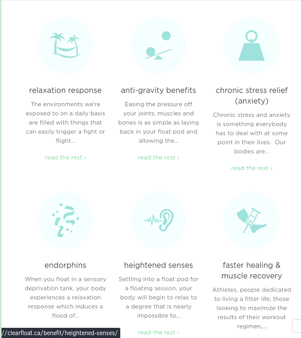

# cpnt200-achievement2
### Will Tengyuan Li
### Client Focused Schema
### Requirement
- Hey, for my website I need a thing where you can add a bunch of chunks of information like in this image.

- I want to have it capped at 6 things and be able to add a logo, benefit title, and spot for a description. Then can you also make the ‘read the rest’ link at the bottom of each thing. I’m pretty set on using that phrase so if it would auto insert that same text, that would be amazing.

### Plan
- Making a Card.
- First thing is a Logo.
- Then a benefit title.
- And a spot for a description
- Finally a link called "read the rest"
### Problem
- I forgot how to fetch the data to a Json file.
- I went back to Ashlyn's class vedio, then figured out.